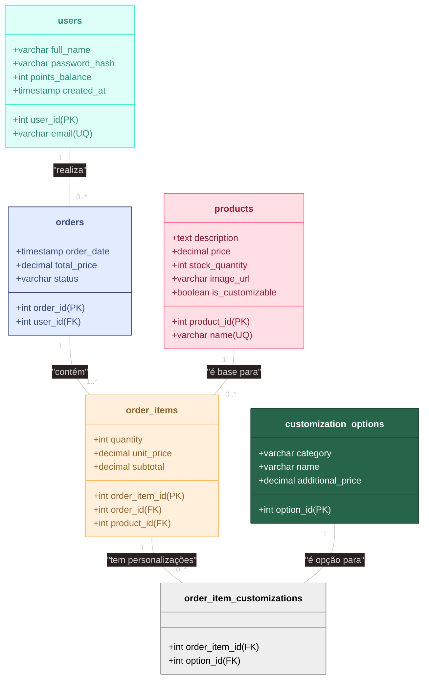
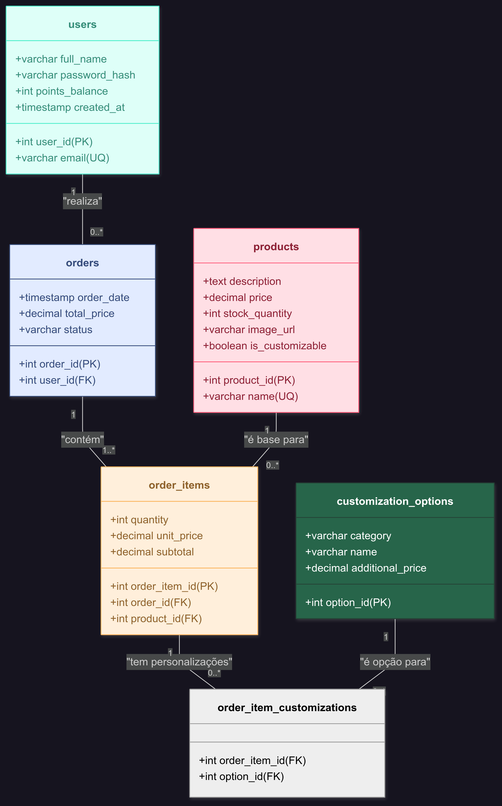

### **Tabelas do Banco de Dados (SQL DDL)**

A seguir estão as definições das tabelas em SQL, projetadas para armazenar as informações de forma organizada e relacional.

#### 1\. Tabela `users`

Armazena as informações dos clientes cadastrados, essencial para o login, perfil e sistema de pontos.

```sql
CREATE TABLE users (
    user_id INT PRIMARY KEY AUTO_INCREMENT,
    full_name VARCHAR(255) NOT NULL,
    email VARCHAR(255) NOT NULL UNIQUE,
    password_hash VARCHAR(255) NOT NULL, -- Criptografada (RNF29)
    points_balance INT DEFAULT 0, -- Inicia com 0 pontos (RF47)
    created_at TIMESTAMP DEFAULT CURRENT_TIMESTAMP
);
```

---

#### 2\. Tabela `products`

Contém os cafés clássicos e as bases para os cafés personalizados.

```sql
CREATE TABLE products (
    product_id INT PRIMARY KEY AUTO_INCREMENT,
    name VARCHAR(100) NOT NULL UNIQUE,
    description TEXT,
    price DECIMAL(10, 2) NOT NULL, -- Preço fixo para clássicos ou base para personalizados (RF05)
    stock_quantity INT NOT NULL DEFAULT 0, -- Para verificação de disponibilidade (RF06)
    image_url VARCHAR(255),
    is_customizable BOOLEAN DEFAULT FALSE -- Distingue bases de cafés clássicos
);
```
---
#### 3\. Tabela `customization_options`

Armazena todos os ingredientes e opções para a montagem de um café personalizado.

```sql
CREATE TABLE customization_options (
    option_id INT PRIMARY KEY AUTO_INCREMENT,
    category VARCHAR(50) NOT NULL, -- Ex: 'Tamanho', 'Leite', 'Sabor', 'Aditivo'
    name VARCHAR(100) NOT NULL,
    additional_price DECIMAL(10, 2) DEFAULT 0.00 -- Preço adicional para o item (RF23)
);
```
---
#### 4\. Tabela `orders`

Registra cada pedido realizado, vinculando-o a um usuário (ou a um cliente não cadastrado).

```sql
CREATE TABLE orders (
    order_id INT PRIMARY KEY AUTO_INCREMENT,
    user_id INT, -- Pode ser nulo para compras sem cadastro (RF10)
    order_date TIMESTAMP DEFAULT CURRENT_TIMESTAMP,
    total_price DECIMAL(10, 2) NOT NULL,
    status VARCHAR(50) DEFAULT 'Pendente',
    FOREIGN KEY (user_id) REFERENCES users(user_id)
);
```
---
#### 5\. Tabela `order_items`

Detalha os itens específicos dentro de cada pedido, sejam eles clássicos ou personalizados.

```sql
CREATE TABLE order_items (
    order_item_id INT PRIMARY KEY AUTO_INCREMENT,
    order_id INT NOT NULL,
    product_id INT NOT NULL, -- O café clássico ou a base do café personalizado
    quantity INT NOT NULL,
    unit_price DECIMAL(10, 2) NOT NULL, -- Preço final do item (com personalizações)
    subtotal DECIMAL(10, 2) NOT NULL, -- (unit_price * quantity) (RF30)
    FOREIGN KEY (order_id) REFERENCES orders(order_id),
    FOREIGN KEY (product_id) REFERENCES products(product_id)
);
```
---

#### 6\. Tabela `order_item_customizations`

Tabela de junção que registra quais opções de personalização foram aplicadas a um item de pedido específico.

```sql
CREATE TABLE order_item_customizations (
    order_item_id INT NOT NULL,
    option_id INT NOT NULL,
    PRIMARY KEY (order_item_id, option_id), -- Chave primária composta
    FOREIGN KEY (order_item_id) REFERENCES order_items(order_item_id),
    FOREIGN KEY (option_id) REFERENCES customization_options(option_id)
);
```

---
### **Esquema de Relacionamento UML**

O diagrama UML abaixo ilustra como as tabelas se conectam, representando as entidades e suas relações de cardinalidade.
A ferramenta utilziada para isso é o Mermaid Live Editor: https://mermaid.live, basta colar o código lá, e você poderá alterar/baixar o diagrama e salvar nos formatos SVG ou PNG.



**Explicação das Relações:**

  * **`users` -- `orders` (1 para muitos):** Um usuário pode realizar zero ou muitos pedidos. Um pedido pertence a no máximo um usuário (pode ser nulo para convidados).
  * **`orders` -- `order_items` (1 para muitos):** Um pedido deve conter pelo menos um item. Cada item pertence a um único pedido.
  * **`products` -- `order_items` (1 para muitos):** Um produto (como "Espresso Tradicional" ou a base "Café Filtrado") pode estar em muitos itens de pedidos diferentes.
  * **`order_items` -- `order_item_customizations` (1 para muitos):** Um item de pedido (se for personalizado) pode ter várias opções de personalização.
  * **`customization_options` -- `order_item_customizations` (1 para muitos):** Uma opção de personalização (como "Leite de Amêndoas") pode ser usada em muitos itens de pedidos diferentes.


  ---
  ### Diagrama UML 
  
  